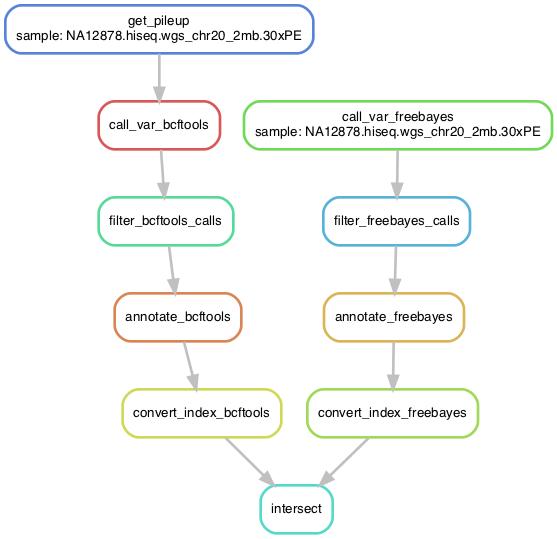
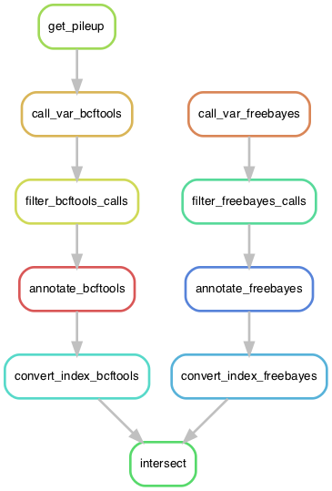

# Introduction

This is a repository for a pipeline written for a variant-calling on a down-sampled data set from [this tutorial](https://melbournebioinformatics.github.io/MelBioInf_docs/tutorials/var_detect_advanced/var_detect_advanced/). The downsampled data set consisted of reads mapping only to chromosome 20.

The pipeline calls variants using two tools, the final outputs of which are later compared:

1. `bcftools`
2. `FreeBayes`

The output from both tools is saved to separate files. At this point, the pipeline bifurcates into two parallel tracks, one track for the output from each tool.

The following instructions are applicable to both tracks:

* After variant-calling, the variants (from both tools) are filtered based on variant quality and depth at the variant site. In addition, they are filtered to include only SNPs, leaving out other kinds of variants such as indels.
* Then, the filtered  variants are annotated with `snpEff`.
* The annotated variants are converted into bgzipped format and indexed using `bcftools`.

Then, the final annotated outputs from both tracks intersected with `bcftools isec` to get the shared annotated snp sites.

Since a "Snakefile" is already present in the directory, the entire pipeline can be executed using `Snakemake`, by running:

``` bash
 snakemake --cores 4
```


# Preprocessing commands

This section contains commands which are not part of the pipeline, but do generate the original input files used by the pipeline.

## `bowtie2` index building

The index for bowtie2 was built using the following command:

``` bash
bowtie2-build -f ./Homo_sapiens.GRCh38.dna.primary_assembly.fa hsapiens.grch38.dna.ens.100 --threads 4
```

## Read qc

Quality of reads was determined using `fastqc`.

``` bash
fastqc NA12878.hiseq.wgs_chr20_2mb.30xPE.fastq_1 -o ./qc
fastqc NA12878.hiseq.wgs_chr20_2mb.30xPE.fastq_2 -o ./qc
```

## Read trimming

Reads were trimmed using `fastp`.

``` bash
fastp  --cut-tail --cut_window_size 5 --cut_mean_quality 20 -i NA12878.hiseq.wgs_chr20_2mb.30xPE_1.fastq -I NA12878.hiseq.wgs_chr20_2mb.30xPE_2.fastq --cut-tail --cut_window_size 5 --cut_mean_quality 20  -o NA12878.hiseq.wgs_chr20_2mb.30xPE_1_trimmed.fastq -O NA12878.hiseq.wgs_chr20_2mb.30xPE_2_trimmed.fastq

fastp -3 -W 5 -M 20 -i NA12878.hiseq.wgs_chr20_2mb.30xPE_1.fastq -I NA12878.hiseq.wgs_chr20_2mb.30xPE_2.fastq  -o NA12878.hiseq.wgs_chr20_2mb.30xPE_1_trimmed.fastq -O NA12878.hiseq.wgs_chr20_2mb.30xPE_2_trimmed.fastq
```

## Aligning

Reads were aligned using `bowtie2`.

``` bash
bowtie2 -x hsapiens.grch38.dna.ens.100 -1 NA12878.hiseq.wgs_chr20_2mb.30xPE_1_trimmed.fastq -2 NA12878.hiseq.wgs_chr20_2mb.30xPE_2_trimmed.fastq -S NA12878.hiseq.wgs_chr20_2mb.30xPE.sam -p 4
```

## Conversion to bam, sorting and indexing

The SAM output file was converted to BAM, after which the original SAM file was removed.

``` bash
samtools view -b -o NA12878.hiseq.wgs_chr20_2mb.30xPE.bam NA12878.hiseq.wgs_chr20_2mb.30xPE.sam
```

The BAM file was sorted and indexed using the following commands:

``` bash
samtools sort NA12878.hiseq.wgs_chr20_2mb.30xPE.bam -o NA12878.hiseq.wgs_chr20_2mb.30xPE.sorted.bam

samtools index NA12878.hiseq.wgs_chr20_2mb.30xPE.sorted.bam
```


# Starting point

The starting point for this pipeline are the sorted BAM files which have been aligned to the reference genome `Homo_sapiens.GRCh38.dna.primary_assembly.fa`, obtained from Ensembl. Alignment has already been performed by `bowtie2`.

# Files not uploaded to repository

The following files have not been uploaded to the repository due to size restrictions from GitHub.

1. The original reads - links to these can be found here:
    2. [mate 1](https://swift.rc.nectar.org.au:8888/v1/AUTH_377/public/variantCalling_ADVNCD/NA12878.hiseq.wgs_chr20_2mb.30xPE.fastq_1)
    3. [mate 2](https://swift.rc.nectar.org.au:8888/v1/AUTH_377/public/variantCalling_ADVNCD/NA12878.hiseq.wgs_chr20_2mb.30xPE.fastq_2)
    4. [This is the original tutorial](https://melbournebioinformatics.github.io/MelBioInf_docs/tutorials/var_detect_advanced/var_detect_advanced/)
3. The original unsorted BAM file.
4. The genome reference file.
4. The `bowtie2` index files.

# Final output

The final output of the pipeline is a set of vcf files with the snps common between those called by `freebayes` and those by `bcftools`.

The final output is contained in the directory "consensus", which contains the following files:

``` bash
0000.bcf
0001.bcf
0002.bcf
0003.bcf
```

The description of the file contents is:

``` bash
This file was produced by vcfisec.
The command line was:	bcftools isec  -c snps -O b -p consensus NA12878.hiseq.wgs_chr20_2mb.30xPE_freebayes_snpEff.vcf.gz NA12878.hiseq.wgs_chr20_2mb.30xPE_bcftools_snpEff.vcf.gz

Using the following file names:
consensus/0000.bcf	for records private to	NA12878.hiseq.wgs_chr20_2mb.30xPE_freebayes_snpEff.vcf.gz
consensus/0001.bcf	for records private to	NA12878.hiseq.wgs_chr20_2mb.30xPE_bcftools_snpEff.vcf.gz
consensus/0002.bcf	for records from NA12878.hiseq.wgs_chr20_2mb.30xPE_freebayes_snpEff.vcf.gz shared by both	NA12878.hiseq.wgs_chr20_2mb.30xPE_freebayes_snpEff.vcf.gz NA12878.hiseq.wgs_chr20_2mb.30xPE_bcftools_snpEff.vcf.gz
consensus/0003.bcf	for records from NA12878.hiseq.wgs_chr20_2mb.30xPE_bcftools_snpEff.vcf.gz shared by both	NA12878.hiseq.wgs_chr20_2mb.30xPE_freebayes_snpEff.vcf.gz NA12878.hiseq.wgs_chr20_2mb.30xPE_bcftools_snpEff.vcf.gz
```


# DAG graph and rule graph

The following is the DAG representing this pipeline:



The following is the rule graph representing this pipeline:


# Content of Snakefile

The following is the content of the Snakefile:

``` python

import os

#%%
def list_directories(dirpath="./", givepath = False):
    '''For a given directory provided as a pathname, list the names of subdirectories directly under it, as just names or as complete path names. Provided as a list.'''
    
    if givepath == False:
        dirnames = []
        for entry in os.scandir(dirpath):
            if os.path.isdir(os.path.join(dirpath, entry.name)):
                dirnames.append(entry.name)
        return dirnames
            
    elif givepath == True:
        dirpathnames = []
        for entry in os.scandir(dirpath):
            if os.path.isdir(os.path.join(dirpath, entry.name)):
                dirpathnames.append(os.path.join(dirpath, entry.name))
        return dirpathnames

def list_files(dirpath="./", givepath = False):
    '''For a given directory provided as a pathname, list the names of file directly under it, as just names or as complete path names. Provided as a list.'''
    
    if givepath == False:
        filenames = []
        for entry in os.scandir(dirpath):
            if os.path.isfile(os.path.join(dirpath, entry.name)):
                filenames.append(entry.name)
        return filenames
            
    elif givepath == True:
        filepathnames = []
        for entry in os.scandir(dirpath):
            if os.path.isfile(os.path.join(dirpath, entry.name)):
                filepathnames.append(os.path.join(dirpath, entry.name))
        return filepathnames

#%%

genome="Homo_sapiens.GRCh38.dna.primary_assembly.fa"

samples = [f.strip(".sorted.bam") for f in list_files() if f.endswith(".sorted.bam")]

rule all:
  input: "consensus"
  

rule get_pileup:
  input:
    gen = genome,
    aln = "{sample}.sorted.bam"
  output: "{sample}.bcf"
  threads: 4
  shell:
    "bcftools mpileup -f {input.gen} {input.aln} --threads {threads} -q 20- -O b -o {output}"


rule call_var_bcftools:
  input: "{sample}.bcf"
  output: "{sample}_bcftools_called.bcf"
  shell:
    "bcftools call -v -m -O b -o {output} {input}"


rule call_var_freebayes:
  input:
    gen=genome,
    aln = "{sample}.sorted.bam"
  output: "{sample}_freebayes_called.vcf"
  shell:
    "freebayes -f {input.gen} -q 20 {input.aln} > {output}"
    

rule filter_bcftools_calls:
  input: "{sample}_bcftools_called.bcf"
  output: "{sample}_bcftools_called_filtered.vcf"
  shell:
    "bcftools filter  -i 'DP>5 & QUAL>20 & TYPE=\"snp\"' -O v -o {output} {input}"


rule filter_freebayes_calls:
  input: "{sample}_freebayes_called.vcf"
  output: "{sample}_freebayes_called_filtered.vcf"
  shell:
    "bcftools filter  -i 'FMT/DP>5 & QUAL>20 & TYPE=\"snp\"' -O v -o {output} {input}"


rule annotate_freebayes:
  input: "{sample}_freebayes_called_filtered.vcf"
  output:
    main="{sample}_freebayes_snpEff.vcf",
    report="{sample}_freebayes_snpEff.html"
  shell:
    "snpEff eff -s {output.report} hg38 {input} > {output.main}"

rule annotate_bcftools:
  input: "{sample}_bcftools_called_filtered.vcf"
  output:
    main="{sample}_bcftools_snpEff.vcf",
    report="{sample}_bcftools_snpEff.html"
  shell:
    "snpEff eff -s {output.report} hg38 {input} > {output.main}"

rule convert_index_bcftools:
  input:
    bcf="{sample}_bcftools_snpEff.vcf"
  output:
    bcf="{sample}_bcftools_snpEff.vcf.gz"
  shell:
    "bcftools view {input.bcf} -O z -o {output.bcf}; bcftools index {output.bcf}"

rule convert_index_freebayes:
  input:
    fb="{sample}_freebayes_snpEff.vcf"
  output:
    fb="{sample}_freebayes_snpEff.vcf.gz"
  shell:
    "bcftools view {input.fb} -O z -o {output.fb}; bcftools index {output.fb}"

rule intersect:
  input:
    bcf= expand("{sample}_bcftools_snpEff.vcf.gz", sample = samples),
    fb = expand("{sample}_freebayes_snpEff.vcf.gz", sample = samples)
  output:
    d=directory("consensus")
  shell:
    "bcftools isec -c snps {input.fb} {input.bcf} -O b -p {output.d}"

```

